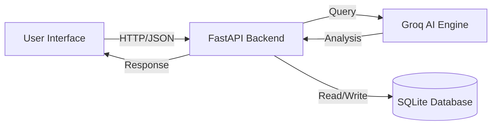

# AI Healthcare Symptom Checker

A production-grade, AI-powered symptom checker designed to provide educational medical insights, reasoning, and potential treatments.

## 🚀 Features

- **AI-Powered Analysis**: Uses advanced LLMs (Llama 3.3 70B) to analyze symptoms.
- **Explainable AI**: Provides **Reasoning** for every suggestion, explaining *why* a condition matches the symptoms.
- **Safety First**: Automatically flags potential **Medical Emergencies**.
- **Cure-Focused**: Explicitly lists simple cures and treatments.
- **User History**: Tracks past consultations for reference.
- **Secure**: JWT-based authentication.

## 🛠️ Tech Stack

- **Backend**: FastAPI (High-performance, Async Python API)
- **Frontend**: Streamlit (Rapid, interactive UI)
- **AI Engine**: Groq API (Llama 3.3 70B Versatile)
- **Database**: SQLite (SQLAlchemy ORM)

## 📋 Setup & Installation

1.  **Clone the repository**
    ```bash
    git clone <repo-url>
    cd symptom-checker
    ```

2.  **Configure Environment**
    Create a `.env` file in the root directory:
    ```env
    GROQ_API_KEY=your_groq_api_key_here
    SECRET_KEY=your_secret_key
    PORT=9002
    ```

3.  **Install Dependencies**
    ```bash
    pip install -r requirements.txt
    ```
    *(Note: Ensure `fastapi`, `uvicorn`, `sqlalchemy`, `streamlit`, `requests`, `python-jose`, `passlib`, `bcrypt`, `groq`, `python-dotenv` are installed)*

4.  **Run the Application**
    
    **Start Backend**:
    ```bash
    python backend/main.py
    ```
    
    **Start Frontend**:
    ```bash
    streamlit run frontend/app.py
    ```

5.  **Access**: Open `http://localhost:8501` in your browser.

## 🏗️ Architecture



## 🛡️ Disclaimer
This tool is for **educational purposes only**. It is not a substitute for professional medical advice, diagnosis, or treatment. Always seek the advice of your physician or other qualified health provider with any questions you may have regarding a medical condition.